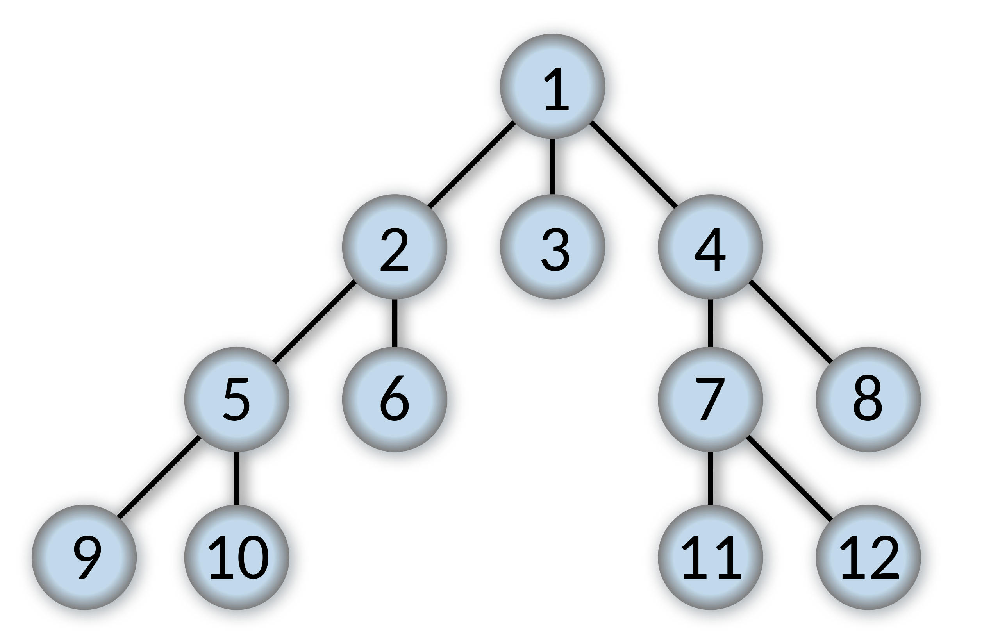

# BFS

# 개념



**Breadth-first search** (**BFS**) is an [algorithm](https://en.wikipedia.org/wiki/Algorithm) for searching a [tree](https://en.wikipedia.org/wiki/Tree_(data_structure)) data structure for a node that satisfies a given property. It starts at the [tree root](https://en.wikipedia.org/wiki/Tree_(data_structure)#Terminology)and explores all nodes at the present [depth](https://en.wikipedia.org/wiki/Tree_(data_structure)#Terminology) prior to moving on to the nodes at the next depth level. Extra memory, usually a [queue](https://en.wikipedia.org/wiki/Queue_(data_structure)), is needed to keep track of the child nodes that were encountered but not yet explored.

저기서 우리는 queue와 but not yet explored를 주목할 필요가 있다.

# BFS하면 자다가도 일어나 술술 짜야 하는 코드

가장 기본으로 배우는 예제 코드가 있는데 이 코드는 누가 쿡 찌르면 바로 튀어나와야 할 정도로 외우고 있어야 한다.

```cpp
int visited[max_y][max_x];
int dy[4] = {0, 0, 1, -1};
int dx[4] = {1, -1, 0, 0};
int n, m;

void bfs(int posy, posx)
{
	queue<pair<int, int>> q;
	q.push({posy, posx});
	visited[posy][posx] = 1;
	while (!q.empty()) {
		pair<int, int> cur = q.front(); q.pop();
		for (int i = 0; i < 4; ++i) {
			int ny = dy[i] + cur.first;
			int nx = dx[i] + cur.second;
			if (ny < 0 || ny >= n || nx < 0 || nx >= m || sth_condition() || visited[ny][nx] == 1)
				continue;
			visited[ny][nx] == 1;
			q.push({ny, nx});
			Action();
		}
	}
}
```

외워.

# 유형 1: 일반적인 경우

상기 기재

# 유형 2: 시작점이 여러개인 경우

큐에 여러 개를 넣으면 된다.

[7576번: 토마토](https://www.acmicpc.net/problem/7576)

# 유형3: 시작점이 두 종류인 경우

큐를 두 개 만들면 된다. 근데 이건 경우에 따라 while문을 따로 2개 할건지, 하나의 while문에 두 큐를 동시에 돌릴건지를 생각해야 한다.

[4179번: 불!](https://www.acmicpc.net/problem/4179)

# 0-1 BFS

BFS는 기본적으로 가중치가 모두 같은 그래프에서만 돌린다. 근데 가중치가 0 또는 1이라면, BFS를 약간 수정해서 정답을 이끌어 낼 수가 있다. 이런 경우, 방문횟수는 더 많지만 가중치의 합이 더 낮은 경우가 생기는데 그 경우를 고려하려면 가중치가 더 낮은 경로부터 탐색해야 하고 가중치가 0인 경로를 큐의 앞(front)에 넣어준다.