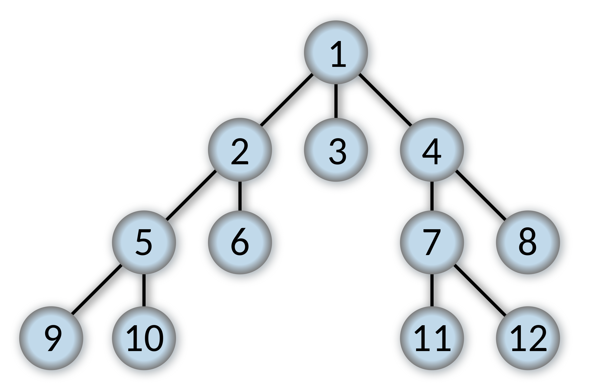

# BFS



**Breadth-first search** (**BFS**) is an [algorithm](https://en.wikipedia.org/wiki/Algorithm) for searching a [tree](https://en.wikipedia.org/wiki/Tree_(data_structure)) data structure for a node that satisfies a given property. It starts at the [tree root](https://en.wikipedia.org/wiki/Tree_(data_structure)#Terminology)and explores all nodes at the present [depth](https://en.wikipedia.org/wiki/Tree_(data_structure)#Terminology) prior to moving on to the nodes at the next depth level. Extra memory, usually a [queue](https://en.wikipedia.org/wiki/Queue_(data_structure)), is needed to keep track of the child nodes that were encountered but not yet explored.

저기서 우리는 queue와 but not yet explored를 주목할 필요가 있다.

# BFS하면 자다가도 일어나 술술 짜야 하는 코드

가장 기본으로 배우는 예제 코드가 있는데 이 코드는 누가 쿡 찌르면 바로 튀어나와야 할 정도로 외우고 있어야 한다.

```cpp
int visited[max_y][max_x];
int dy[4] = {0, 0, 1, -1};
int dx[4] = {1, -1, 0, 0};
int n, m;

void bfs(int posy, posx)
{
	queue<pair<int, int>> q;
	q.push({posy, posx});
	visited[posy][posx] = 1;
	while (!q.empty()) {
		pair<int, int> cur = q.front(); q.pop();
		for (int i = 0; i < 4; ++i) {
			int ny = dy[i] + cur.first;
			int nx = dx[i] + cur.second;
			if (ny < 0 || ny >= n || nx < 0 || nx >= m || sth_condition() || visited[ny][nx] == 1)
				continue;
			visited[ny][nx] == 1;
			q.push({ny, nx});
			Action();
		}
	}
}
```

외워.

# 유형 1: Flood Fill 영역 넓이 구하기

[1926번: 그림](https://www.acmicpc.net/problem/1926)

체크해야 하는 그림이 여러 개이기 때문에 BFS함수를 여러번 돌려 주어야 한다.

``` java
import java.util.*;
import java.io.*;

class Node {
    int y, x;
    Node(int _y, int _x) {
        this.y = _y;
        this.x = _x;
    }
}

public class Main1926 {

    static int n, m, max_area = 0, painting_num = 0;
    static boolean visited[][];
    static int painting[][];
    static int dy[] = {0, 0, -1, 1};
    static int dx[] = {-1, 1, 0, 0};

    static int bfs(int start_y, int start_x) {
        int area = 0;
        Queue<Node> q = new LinkedList<>();
        visited[start_y][start_x] = true;
        q.add(new Node(start_y, start_x));

        while (!q.isEmpty()) {
            Node cur = q.poll();
            ++area;
            for (int i = 0; i < 4; ++i) {
                int ny = cur.y + dy[i];
                int nx = cur.x + dx[i];
                if (ny < 0 || ny >= n || nx < 0 || nx >= m || visited[ny][nx] || painting[ny][nx] == 0)
                    continue;
                visited[ny][nx] = true;
                q.add(new Node(ny, nx));
            }
        }

        max_area = Math.max(max_area, area);
        return 1;
    }

    public static void main(String[] args) throws IOException {
        BufferedReader br = new BufferedReader(new InputStreamReader(System.in));

        String tmp[] = br.readLine().split(" ");
        n = Integer.parseInt(tmp[0]);
        m = Integer.parseInt(tmp[1]);
        visited = new boolean[n][m];
        painting = new int[n][m];

        for (int i = 0; i < n; ++i) {
            tmp = br.readLine().split(" ");
            for (int j = 0; j < m; ++j) {
                painting[i][j] = Integer.parseInt(tmp[j]);
            }
        }

        for (int i = 0; i < n; ++i)
            for (int j = 0; j < m; ++j)
                if (!visited[i][j] && painting[i][j] == 1)
                    painting_num += bfs(i, j);
        
        System.out.println(painting_num);
        System.out.println(max_area);
    }
}
```

# 유형 2: 최단경로 거리 측정

[2178번: 미로탐색](https://www.acmicpc.net/problem/2178)

가장 쉬운 유형이고 설명이 필요없다.

``` java
import java.util.*;
import java.io.*;

class Node {
    int y, x;

    Node(int _y, int _x) {
        this.y = _y;
        this.x = _x;
    }
}

public class Main2178 {
    static int n, m;
    static int visited[][];
    static int board[][];
    static int dy[] = {0, 0, -1, 1};
    static int dx[] = {1, -1, 0, 0};

    static void bfs(int start_y, int start_x) {
        Queue<Node> q = new LinkedList<>();
        q.add(new Node(start_y, start_x));
        visited[start_y][start_x] = 1;

        while (!q.isEmpty()) {
            Node cur = q.poll();
            for (int i = 0; i < 4; ++i) {
                Node nxt = new Node(cur.y + dy[i], cur.x + dx[i]);
                if (nxt.y < 0 || nxt.y >= n || nxt.x < 0 || nxt.x >= m || visited[nxt.y][nxt.x] != 0 || board[nxt.y][nxt.x] == 0)
                    continue;
                q.add(nxt);
                visited[nxt.y][nxt.x] = visited[cur.y][cur.x] + 1;
            }
        }
    }
    public static void main(String[] args) throws IOException {
        BufferedReader br = new BufferedReader(new InputStreamReader(System.in));
        String[] tmp = br.readLine().split(" ");
        n = Integer.parseInt(tmp[0]);
        m = Integer.parseInt(tmp[1]);
        visited = new int[n][m];
        board = new int[n][m];

        for (int i = 0; i < n; ++i) {
            String line = br.readLine();
            for (int j = 0; j < m; ++j)
                board[i][j] = line.charAt(j) - '0';
        }

        bfs(0, 0);

        System.out.println(visited[n - 1][m - 1]);
    }
}
```

# 유형 2: 시작점이 여러개인 경우

큐에 여러 개를 넣으면 된다. 여기서 중요한게, 시작점이 모두 동일한 성격을 띄어야 한다.

[7576번: 토마토](https://www.acmicpc.net/problem/7576)

```java
import java.io.*;
import java.util.*;

class Node {
    int y, x;
    Node(int _y, int _x) {
        this.y = _y;
        this.x = _x;
    }
}

public class Main7576 {
    static int n, m;
    static int box[][];

    static void bfs(Queue<Node> q) {
        int dy[] = {0, 0, -1, 1};
        int dx[] = {-1, 1, 0, 0};
        while (!q.isEmpty()) {
            Node cur = q.poll();
            for (int i = 0; i < 4; ++i) {
                int ny = cur.y + dy[i];
                int nx = cur.x + dx[i];
                if (ny < 0 || ny >= n || nx < 0 || nx >= m || box[ny][nx] == -1 || box[ny][nx] > 0)
                    continue;
                box[ny][nx] = box[cur.y][cur.x] + 1;
                q.add(new Node(ny, nx));
            }
        }
    }

    public static void main(String[] args) throws IOException {
        BufferedReader br = new BufferedReader(new InputStreamReader(System.in));
        String[] tmp = br.readLine().split(" ");
        n = Integer.parseInt(tmp[1]);
        m = Integer.parseInt(tmp[0]);
        box = new int[n][m];
        Queue<Node> startPoint = new LinkedList<>();

        for (int i = 0; i < n; ++i) {
            tmp = br.readLine().split(" ");
            for (int j = 0; j < m; ++j) {
                box[i][j] = Integer.parseInt(tmp[j]);
                if (box[i][j] == 1)
                    startPoint.add(new Node(i, j));
            }
        }

        bfs(startPoint);
        int max_day = 0;
        for (int i = 0; i < n; ++i) {
            for (int j = 0; j < m; ++j) {
                if (box[i][j] == 0) {
                    System.out.println(-1);
                    return;
                }
                max_day = Math.max(max_day, box[i][j]);
            }
        }
        System.out.println(max_day - 1);
    }
}
```

# 유형3: 시작점이 두 종류인 경우

큐를 두 개 만들면 된다. 근데 이건 경우에 따라 while문을 따로 2개 할건지, 하나의 while문에 두 큐를 동시에 돌릴건지를 생각해야 한다. 아래 예제에서는 while문을 따로 2개 만들어야 하는데 그 이유는, 하나의 종류가 완전히 끝난 다음에야 다른 종류가 시작할 수 있기 때문이다. 따라서, 어떤 종류가 완전히 끝난 다음 다른 종류를 시작할지 아니면 동시에 진행해도 괜찮은지를 판단해서 while문의 개수를 결정하자.  

[4179번: 불!](https://www.acmicpc.net/problem/4179)

```java
import java.util.*;
import java.io.*;

class Node {
    int y, x;
    Node(int _y, int _x) {
        this.y = _y;
        this.x = _x;
    }
}

class Main4179 {

    static int n, m;
    static int[][] forest;
    static int[][] distJ;
    static int[][] distF;

    static void bfs(Queue<Node> qFire, Queue<Node> qJoe) {
        int dy[] = {0, 0, -1, 1};
        int dx[] = {-1, 1, 0, 0};
        while (!qFire.isEmpty()) {
            Node cur = qFire.poll();
            for (int i = 0; i < 4; ++i) {
                int ny = cur.y + dy[i];
                int nx = cur.x + dx[i];
                if (ny < 0 || ny >= n || nx < 0 || nx >= m || distF[ny][nx] != 0 || forest[ny][nx] == 1)
                    continue;
                qFire.add(new Node(ny, nx));
                distF[ny][nx] = distF[cur.y][cur.x] + 1;
            }
        }

        while (!qJoe.isEmpty()) {
            Node cur = qJoe.poll();
            if (cur.y == 0 || cur.y == n - 1 || cur.x == 0 || cur.x == m - 1) {
                System.out.println(distJ[cur.y][cur.x]);
                return;
            }
            for (int i = 0; i < 4; ++i) {
                int ny = cur.y + dy[i];
                int nx = cur.x + dx[i];
                if (distJ[ny][nx] != 0 || forest[ny][nx] == 1)
                    continue;
                if (distF[ny][nx] != 0 && distF[ny][nx] <= distJ[cur.y][cur.x] + 1)
                    continue;
                qJoe.add(new Node(ny, nx));
                distJ[ny][nx] = distJ[cur.y][cur.x] + 1;
            }
        }
        System.out.println("IMPOSSIBLE");
        return;
    }

    public static void main(String[] args) throws IOException {
        BufferedReader br = new BufferedReader(new InputStreamReader(System.in));
        String[] tmp = br.readLine().split(" ");
        n = Integer.parseInt(tmp[0]);
        m = Integer.parseInt(tmp[1]);
        Queue<Node> qFire = new LinkedList<>();
        Queue<Node> qJoe = new LinkedList<>();
        forest = new int[n][m];
        distJ = new int[n][m];
        distF = new int[n][m];

        for (int i = 0; i < n; ++i) {
            String line = br.readLine();
            for (int j = 0; j < m; ++j) {
                if (line.charAt(j) == '#')
                    forest[i][j] = 1;
                else if (line.charAt(j) == '.')
                    forest[i][j] = 0;
                else if (line.charAt(j) == 'J') {
                    forest[i][j] = 0;
                    qJoe.add(new Node(i, j));
                    distJ[i][j] = 1;
                }
                else if (line.charAt(j) == 'F') {
                    forest[i][j] = 1;
                    qFire.add(new Node(i, j));
                    distF[i][j] = 1;
                }
            }
        }

        bfs(qFire, qJoe);
    }
}
```

# 유형4: 1차원 BFS

BFS가 꼭 상하좌우로만 움직여야 하는 것은 아니다. BFS에서 중요한 점은 **level order traverse**의 성격을 만족하는지 이다. 아래 예시에서도, 비록 상하좌우로 이동하는 것은 아니지만, 세 종류의 이동을 모두 같은 level로 보아야 하기 때문에 BFS로 풀어야 한다.

[1697번: 숨바꼭질](https://www.acmicpc.net/problem/1697)

```java
import java.util.*;
import java.io.*;

public class Main1697 {
    static int n, k;
    static int[] dist = new int[100001];

    static int bfs() {
        Queue<Integer> q = new LinkedList<>();
        q.add(n);
        while(!q.isEmpty()) {
            int cur = q.poll();
            if (cur == k)
                return dist[cur];
            int d[] = {cur - 1, cur + 1, cur * 2};
            for (int i = 0; i < 3; ++i) {
                int nxt = d[i];
                if (nxt > 100000 || nxt < 0)
                    continue;
                if (dist[nxt] != 0 && dist[nxt] <= dist[cur] + 1)
                    continue;
                q.add(nxt);
                dist[nxt] = dist[cur] + 1;
            }
        }
        return -1;
    }
    public static void main(String[] args) throws IOException {
        BufferedReader br = new BufferedReader(new InputStreamReader(System.in));
        String[] tmp = br.readLine().split(" ");
        n = Integer.parseInt(tmp[0]);
        k = Integer.parseInt(tmp[1]);
        System.out.println(bfs());
    }
}
```

# 유형5: 0-1 BFS

BFS는 기본적으로 가중치가 모두 같은 그래프에서만 돌린다. 근데 가중치가 0 또는 1이라면, BFS를 약간 수정해서 정답을 이끌어 낼 수가 있다. 이런 경우, 방문횟수는 더 많지만 가중치의 합이 더 낮은 경우가 생기는데 그 경우를 고려하려면 가중치가 더 낮은 경로부터 탐색해야 하고 가중치가 0인 경로를 큐의 앞(front)에 넣어준다.

[2423번: 전구를 켜라](https://www.acmicpc.net/problem/2423)